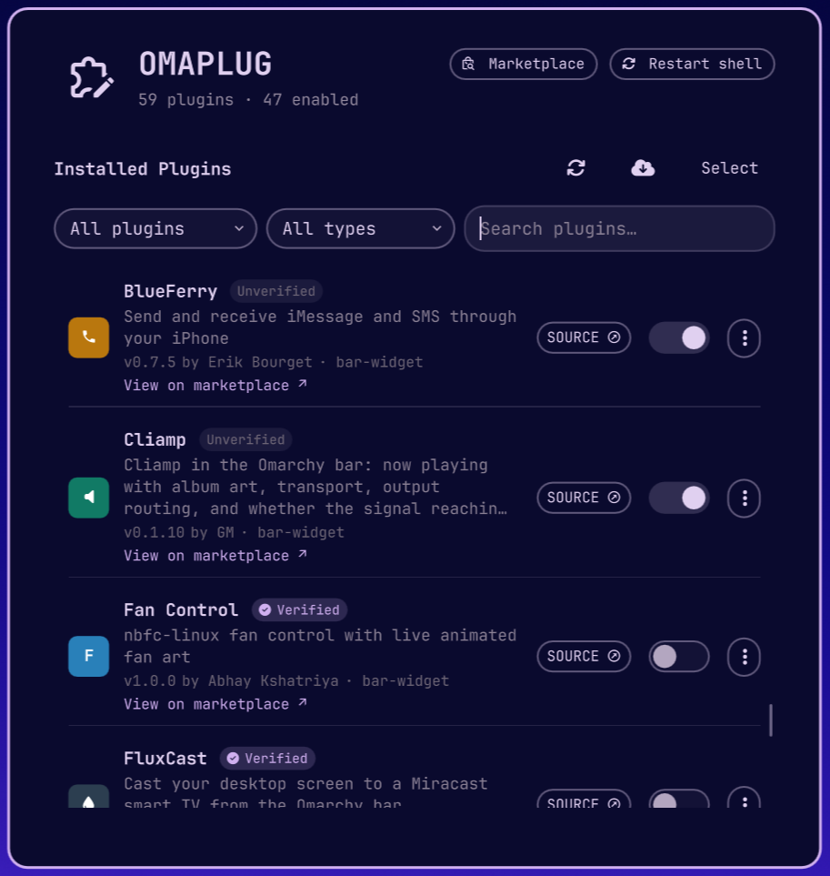
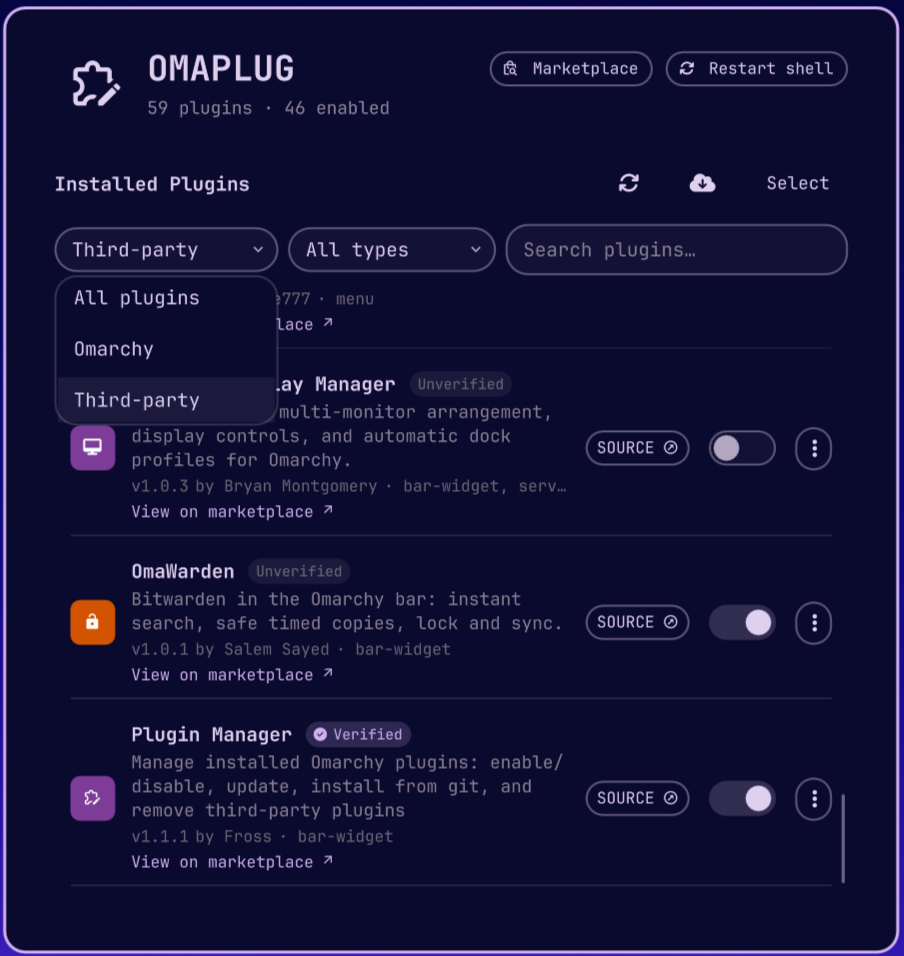

# 🧩 Omaplug

**A small tool for managing your Omarchy plugins.**

[](https://plugins.omarchy.org/plugin.html?id=omaplug) [](https://github.com/omacom/omarchy-plugin-marketplace/blob/main/SECURITY.md#automated-security-baseline)

Access it right from the Omarchy bar — it gives you a centralized place to view and organize the plugins you have installed. Here are a few things you can use it for:

- Easily turn individual plugins on or off as needed.
- Check for available updates and update them individually — or all at once.
- Remove plugins individually, or several in one go.
- Jump straight to each plugin's repo, or browse the [Omarchy marketplace](https://plugins.omarchy.org).

Omaplug is listed on the marketplace: [plugins.omarchy.org/plugin.html?id=omaplug](https://plugins.omarchy.org/plugin.html?id=omaplug)

## Screenshots


<table>
  <tr>
    <td align="center"></td>
    <td align="center"></td>
    <td align="center"></td>
  </tr>
  <tr>
    <td align="center">Plugin list</td>
    <td align="center">Checking for updates</td>
    <td align="center">Installing a plugin</td>
  </tr>
  <tr>
    <td align="center"></td>
    <td align="center"></td>
    <td align="center"></td>
  </tr>
  <tr>
    <td align="center">Scope filter</td>
    <td align="center">Type filter</td>
    <td align="center">Row action menu</td>
  </tr>
</table>

## What it can do

- **🔌 Enable / disable** — every discovered plugin (Omarchy's own and third-party) gets a simple toggle. Flipping it goes through the same registry the `omarchy plugin enable/disable` command uses, so what you see here is always what's really running.
- **🔄 Check for updates** — scans every installed third-party plugin and distinguishes clean updates from local plugins, symlinked development plugins, local changes, and genuine fetch errors.
- **⬆️ Update (or update everything)** — apply one update, or finish every proven-safe pending update from a single click, even while Omarchy reloads changed plugins.
- **➕ Install** — paste a git repo URL and add a plugin in one step. It'll warn you first that plugins run as unsandboxed code, because honesty is the default here.
- **🔍 Reviewed before install** — the repository is cloned to a scratch directory, every source file is bundled, and Claude reads it with no tools and no ability to act, then answers with a verdict (`safe` / `caution` / `danger`), a plain-language summary, what the plugin *can* do, and concrete findings. You see all of that before `omarchy plugin add` runs, and you always get the final say. After install the checkout is compared to the commit that was reviewed, so an upstream push in between can't slip past.
- **🗑️ Remove** — third-party plugins only. Trash one, or enter Select mode to check several and remove them all at once (with a confirmation, no accidents).
- **🔗 Source link** — every git-managed plugin gets a `SOURCE` button that jumps straight to its repo page.
- **🔍 Search & filter** — narrow the list to Omarchy plugins, third-party plugins, or search by name, description, ID, author, or kind.
- **♻️ Restart shell** — if a plugin ever acts up from stale compiled code, one button clears the QML cache and restarts the shell so everything reloads fresh.

## Install

```bash
omarchy plugin add https://github.com/fross100/omaplug --enable
```

## Remove

```bash
omarchy plugin remove omaplug
```

## Remove manually

No terminal? No problem — or maybe you just like doing things the hands-on way. Here's how to remove it by hand:

1. Delete the plugin folder:

```bash
rm -rf ~/.config/omarchy/plugins/omaplug
```

2. Remove the `"id": "omaplug"` entry from the bar layout in `~/.config/omarchy/shell.json`.

3. Restart the shell to apply:

```bash
omarchy-restart-shell
```

## Pre-install review

Every install goes through `review-helper.sh` first. It runs the [Claude Code](https://claude.com/claude-code) CLI in headless mode (`claude -p`) using your existing login — no API key is stored in this plugin — with tools disabled and the repository handed over on stdin, so a hostile repository has nothing to steer. Each file is wrapped in delimiters carrying a per-run nonce so file contents can't forge a boundary, and the reviewer is told to treat anything that addresses it as a prompt-injection attempt (which forces a `danger` verdict).

The verdict is advice, not a gate: `safe` offers **Install**, `caution` and `danger` offer **Install anyway**, and a review that couldn't run (no `claude`, not logged in, timeout, over budget) offers **Retry** or **Install without review**. Nothing is enabled automatically either way.

The result opens in its own floating window, centred on the monitor you are looking at and sized to fit the whole review, so the buttons are always on screen; the desktop stays usable underneath while a review runs.

A review of a typical plugin costs well under a dollar on the default model and takes under a minute. Pick the model and effort per widget in `shell.json` (these are the bar widget's settings, so Omarchy's widget settings UI shows them too):

```json
{ "id": "omaplug", "reviewModel": "claude-opus-5", "reviewEffort": "medium" }
```

The same knobs, plus budget and timeout, are environment variables on the shell process:

| Variable | Default | Meaning |
| --- | --- | --- |
| `OMAPLUG_REVIEW_MODEL` | `claude-fable-5-1` | Model passed to `claude --model` |
| `OMAPLUG_REVIEW_EFFORT` | `high` | `claude --effort` level |
| `OMAPLUG_REVIEW_BUDGET_USD` | `5` | Hard cap per review (`--max-budget-usd`) |
| `OMAPLUG_REVIEW_TIMEOUT` | `600` | Seconds before the review is killed |

An LLM review is a screen, not a proof. It reads the code as it is at that commit; it can't see what a later update brings, and a determined author can still hide behaviour behind runtime downloads or obfuscation the reviewer flags but can't resolve. Treat `safe` as "nothing found", not "nothing there".

## Requirements

- Omarchy 4.x
- Quickshell
- `git`, `jq`, and the `omarchy` CLI
- Standard coreutils (`setsid`, `nohup`, `timeout`, `sed`)
- [Claude Code](https://claude.com/claude-code) (`claude` on `PATH`, logged in) for the pre-install review — optional; without it, installs offer "Install without review"

## License

[MIT](LICENSE) © 2026 Fross
